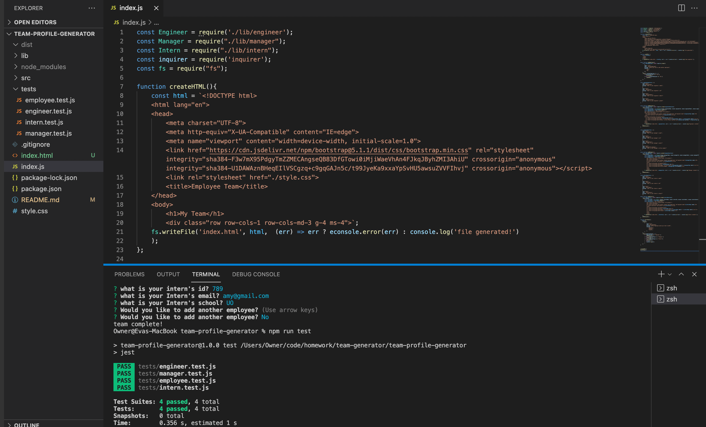

# Team Profile Generator 

## Objective
A command-line application takes in information about employees on a software engineering team, then generates an HTML webpage that displays summaries for each person. User is prompted by via inquirer for type of employee followed by additional questions based on employee type. Once user inputs all informaiton, they can choose to add another employee or complete their team. 

## Technologies Used
HTML, CSS, Javascript, Node.js, Inquirer, Jest

## Links
* Repo: https://github.com/evapopp/team-profile-generator
* Video Demo: https://drive.google.com/file/d/1iDaewW2qB6mOjTXJEJ49ksZkipFBf-Pi/view

## Page Preview

